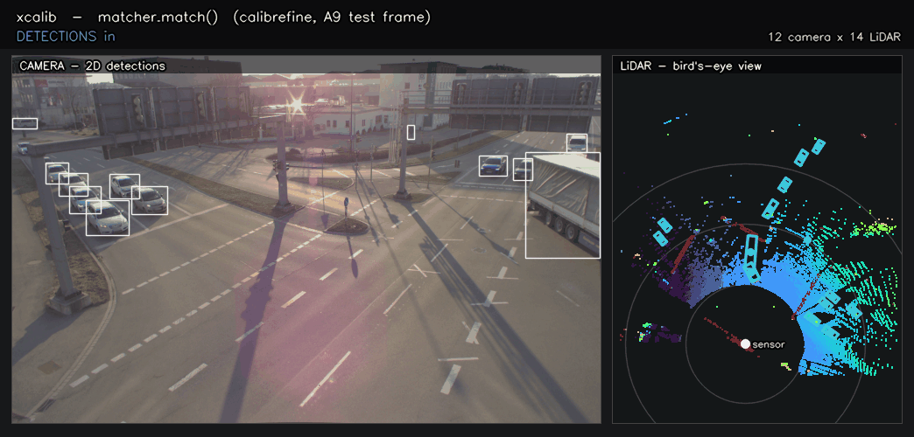
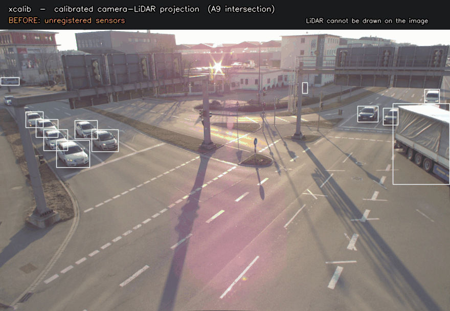

# XCalib

[](https://github.com/radar-lab/XCalib/actions/workflows/ci.yml)
[](https://radar-lab.github.io/XCalib/)
[](https://pypi.org/project/XCalib/)
[](LICENSE)
[](https://colab.research.google.com/github/radar-lab/XCalib/blob/main/demo/xcalib_quickstart.ipynb)

Camera-LiDAR cross-modal matching for edge devices: pretrained matchers,
targetless extrinsic calibration, ONNX/TensorRT export, HDF5 training, and
label-free one-shot adaptation — behind one small API.

`xcalib` is the deployment package for the matching front-end studied in
*Position Encoding in Detection-Based LiDAR–Camera Matching: A Diagnostic
Study at Infrastructure Sites* (accepted at IEEE Sensors Letters). The same weights run on a
lab workstation and an NVIDIA Jetson AGX Thor. It builds on the lab's prior
targetless calibration framework
[CalibRefine](https://github.com/radar-lab/Lidar_Camera_Automatic_Calibration)
(Cheng et al., IEEE TIM 2026, [arXiv:2502.17648](https://arxiv.org/abs/2502.17648)).

> **Status** — publicly released and actively developed. The public API
> (`xcalib.__all__`) is stable across minor versions; internals may change
> without notice. Broader visibility is expected once the accompanying IEEE
> Sensors Letters paper is published. New versions are cut from `main` as tagged
> releases.

**Docs: [radar-lab.github.io/XCalib](https://radar-lab.github.io/XCalib/)**

## Install

```bash
pip install XCalib            # inference
pip install "XCalib[onnx]"    # + ONNX export / onnxruntime parity checks
pip install "XCalib[train]"   # + h5py (HDF5 training / fine-tuning)
```

For normal use, install the wheel from PyPI once it is published; downloading
or building from source is not required. Source checkouts are for development,
paper validation, or local experimentation.

Requires Python 3.10+ (CI tests 3.10 through 3.14). The wheel pins
`torch>=2.2` only. On Jetson AGX Thor the default PyPI torch (>= 2.12,
aarch64 + bundled CUDA 13) works out of the box; on x86 install the CUDA
build you need first and pip will leave it alone. After install the
`xcalib` CLI is on `$PATH` and configs resolve from package data — no checkout
required.

For development, [pixi](https://pixi.sh) drives everything (the manifest
lives in `pyproject.toml` under `[tool.pixi.*]`):

```bash
pixi install            # per-platform torch (CUDA 12.8 on x86, PyPI CUDA-13 on Thor)
pixi run test           # full suite
pixi run smoke          # quick synthetic-frame smoke tests
```

| Platform                | torch source                                      |
|-------------------------|---------------------------------------------------|
| `linux-aarch64` (Thor)  | PyPI (`torch>=2.12`, cp31x manylinux_2_28 + cu13) |
| `linux-64` / `win-64`   | `https://download.pytorch.org/whl/cu128`          |
| `osx-arm64`             | PyPI (CPU build, used only for code review)       |

## Quickstart

> Prefer a runnable, end-to-end walkthrough (install → Hub weights/data → match →
> calibrate, with inline overlays)? Open
> [`demo/xcalib_quickstart.ipynb`](demo/xcalib_quickstart.ipynb) locally or in
> [Colab](https://colab.research.google.com/github/radar-lab/XCalib/blob/main/demo/xcalib_quickstart.ipynb).

```python
import cv2, numpy as np
from xcalib import Matcher

matcher = Matcher.from_pretrained("crlite", site="a9_dataset_r02_s01")
# ... or local: Matcher.from_pretrained("crlite", weights="checkpoints/crlite_custom_best.pth")

image       = cv2.cvtColor(cv2.imread("frame.jpg"), cv2.COLOR_BGR2RGB)  # H,W,3 uint8
point_cloud = np.load("frame_lidar.npy").astype(np.float32)             # N,3 (X,Y,Z)
bboxes_2d   = np.array([[100, 200, 180, 320]], dtype=np.float32)        # K,4 (x1,y1,x2,y2)
bboxes_3d   = np.array([[5.0, -2.0, -1.5, 8.0, 0.5, 0.5]], dtype=np.float32)  # M,6

result = matcher.match(image, point_cloud, bboxes_2d, bboxes_3d,
                       top_k=5, validate="warn")
print(result.similarity)    # K x M float32 in [0, 1]
print(result.matches)       # [(img_idx, lid_idx, score), ...]
```

Everything a deployment needs hangs off the `Matcher`:

```python
matcher.pair(...)                                  # alias of match()
matcher.build("onnx", output_dir="onnx/crlite")    # export + torch parity check
matcher.build("trt", precision="fp16")             # Jetson: trtexec + shape profiles

K = xcalib.CameraIntrinsics(fx=1418., fy=1422., cx=976., cy=606.)
matcher.calibrate(frames, intrinsics=K)            # targetless PnP/RANSAC extrinsics

session = matcher.oneshot(K)                       # label-free adaptation:
session.observe(image, pc, b2, b3)                 #   confident matches -> projection
session.adapt(steps=50)                            #   -> pseudo-labels -> adapter updates
session.save("runs/site_adapted")

matcher.train("train.h5", "val.h5", epochs=10)     # fine-tune loaded weights
matcher.save_pretrained("runs/my_model")           # weights + config
```

Training and dataset helpers:

```python
from xcalib import train, load_dataset

best = train("crlite", "a9_dataset_r02_s01", "a9_dataset_r02_s01",
             site="a9_dataset_r02_s01", epochs=100, warmup_epochs=5,
             optimizer="adam", scheduler="cosine")          # paper recipe
loader = load_dataset("a9_dataset_r02_s01", split="test")   # Hub or local cache
```

External configs work the same way as packaged configs, so users can keep a
custom YAML next to custom weights:

```python
matcher = Matcher.from_pretrained(
    "crlite",
    weights="runs/site42/best.pth",
    config="runs/site42/crlite_site42.yaml",   # outside the wheel/package
)
```

Architecture keys are read from that YAML before the model is built. Common
knobs include `embed_dim`, `token_len`, `top_k`, `crop_size`,
`point_cloud_size`, `vit.depth`, `vit.num_heads`, `gnn.num_layers`,
`gnn.hidden_dim`, `similarity_head.hidden_dims`, and the CalibRefine
`dense.*` widths. Changing shapes requires weights trained with the same cfg;
released checkpoints should stay with their packaged configs.

The exact input contract (RGB `uint8`, finite `float32` meters, shape and
sync requirements) is specified in
[docs/protocol.md](docs/protocol.md) and enforced by
`validate="strict" | "warn" | "off"`.

## See it in action

Rendered from the public A9 (TUMTraf intersection) test cache with real
checkpoints (`scripts/make_demo_media.py`):



`matcher.match()` scores every camera x LiDAR detection pair and locks the
confident argmax per camera box (green links span the image and the bird's-eye
LiDAR view); below-threshold rows stay unmatched on purpose.



Those matches are what `matcher.calibrate()` feeds to PnP/RANSAC to recover
the camera-LiDAR extrinsics without targets — once calibrated, the cloud and
3D detections land on the scene. One-shot adaptation (`matcher.oneshot()`)
then uses that projection as a label-free supervisor to keep adapting the
matcher on-site. Details and caveats: [docs](https://radar-lab.github.io/XCalib/#see-it-in-action).

## Model zoo

| Model             | Backbone            | Position encoding                        | Tier            |
|-------------------|---------------------|------------------------------------------|-----------------|
| `crlite`          | ResNet + PointNet   | Enhanced 3D (2D-sin + depth MLP + 3D MLP)| paper           |
| `crlite_2dpe`     | ResNet + PointNet   | 2D-only (`pe_mode=2d_only`)              | paper           |
| `crlite_vit_exp1` | crop-ViT + PointNet | none                                     | paper           |
| `crlite_vit_exp3` | crop-ViT + PointNet | Enhanced 3D                              | paper           |
| `calibrefine`     | ResNet + PointNet2  | 2D sinusoidal (pairwise)                 | paper baseline  |
| `crlite_vit_exp4` | crop-ViT + GAT      | edge-aware GAT over boxes & centres      | delivery only   |

`calibrefine` is our standalone port of the Common Feature Discriminator from
[CalibRefine](https://github.com/radar-lab/Lidar_Camera_Automatic_Calibration)
(Cheng et al., IEEE TIM 2026, [arXiv:2502.17648](https://arxiv.org/abs/2502.17648)),
kept as the pairwise baseline the paper compares against.

Each released model ships with a matching checkpoint and config. See
[docs/hub.md](docs/hub.md) for public loading and download conventions;
[docs/adding-models.md](docs/adding-models.md) for how new models land here.

## Datasets

HDF5 matching caches (schema: [docs/hdf5-format.md](docs/hdf5-format.md)):

- `a9_dataset_r02_s01`: public Hub artifact for the accepted-paper release.

```bash
xcalib pull-dataset --site a9_dataset_r02_s01 --split test
```

`load_dataset(site, split)` prefers a checkout-local cache and falls back to
released Hub artifacts when available. The A9 caches derive from the TUM
Traffic (A9) dataset (CC BY-NC-ND 4.0); users remain responsible for following
upstream dataset terms.

## CLI

```bash
xcalib demo         --model crlite_vit_exp1 --weights ... --device cpu
xcalib export-onnx  --model crlite --site a9_dataset_r02_s01
xcalib build-trt    --model crlite --site a9_dataset_r02_s01 --precision fp16
xcalib pull-weights --model crlite --site a9_dataset_r02_s01
xcalib pull-dataset --site a9_dataset_r02_s01 --split test
xcalib version
```

## Reproducing the paper

Validation commands, public A9 Table I numbers, frozen UTC reference artefacts,
and latency benchmarks moved to **[docs/paper.md](docs/paper.md)**.

Public reproducibility is anchored on A9. UTC3/UTC4 entries are frozen
reference artefacts for manuscript reconciliation and can only be rerun by
partners who hold the institutional UTC HDF5 caches and weights; those data are
not shipped in this public repository.

```bash
pixi run validate-a9          # public A9 Table I column
pixi run benchmark            # synthetic latency figure, no UTC data required
```

Frozen evaluation summaries cited by the supplemental:
[docs/evidence/index.md](docs/evidence/index.md).

## Repository layout

```text
./
├── pyproject.toml            packaging + pixi env + ruff (single config file)
├── mkdocs.yml                docs site (GitHub Pages)
├── src/xcalib/               the package (ships in the wheel)
│   ├── engine/               matcher, wrappers, exporter, trt, trainer
│   ├── models/               architectures + registry
│   ├── oneshot/              PnP/RANSAC calibration, pseudo-labels, adapters
│   ├── hub/                  Hub download helpers for weights + datasets
│   ├── data/                 cropping helpers + HDF5 loader (lazy h5py)
│   ├── utils/                config, io, metrics, torch_check
│   ├── cfg/                  packaged per-(model, site) YAML configs
│   ├── protocol.py           input contract (validate_frame_inputs, intrinsics)
│   └── cli.py                `xcalib` console entry point
├── scripts/                  public demos, smoke helpers, and docs guards
│   └── paper/                paper validation, export, TRT, and benchmark scripts
├── tests/                    grouped pytest suite (smoke/unit/integration)
├── docs/                     docs site sources (see mkdocs.yml nav)
│   └── evidence/             frozen JSON evidence linked from the paper docs
├── checkpoints/              optional local .pth files (gitignored)
└── datasets/                 optional local HDF5 caches (gitignored)
```

## API stability

Only the symbols exported by `xcalib.__all__` (`Matcher`, `train`,
`load_dataset`, result dataclasses, protocol types) are stable across minor
versions. Anything imported from submodules is internal and may change
without notice.

## License and citation

Code is licensed under [Apache-2.0](LICENSE). The A9/TUM Traffic dataset has
its own CC BY-NC-ND 4.0 terms.

If you use this package in academic work, please cite the xcalib paper. The
entry below is accepted-paper metadata; replace the paper URL / DOI once the
publisher page is live:

```bibtex
@article{guo2026xcalib,
  author  = {Guo, Lihao and Tang, Jiahao and Bang, Tam and Zhang, Tianya and
             Harris, Austin and Sartipi, Mina and Cao, Siyang},
  title   = {Position Encoding in Detection-Based LiDAR--Camera Matching:
             A Diagnostic Study at Infrastructure Sites},
  journal = {IEEE Sensors Letters},
  year    = {2026},
  note    = {Accepted. Paper URL pending. Code:
             https://github.com/radar-lab/XCalib},
}
```

For the `calibrefine` baseline and the auto-calibration framework this work
builds on, cite:

```bibtex
@article{cheng2026calibrefine,
  author  = {Cheng, Lei and Guo, Lihao and Zhang, Tianya and Bang, Tam and
             Harris, Austin and Hajij, Mustafa and Sartipi, Mina and
             Cao, Siyang},
  title   = {CalibRefine: Deep Learning-Based Online Automatic Targetless
             LiDAR-Camera Calibration With Iterative and Attention-Driven
             Post-Refinement},
  journal = {IEEE Transactions on Instrumentation and Measurement},
  volume  = {75},
  year    = {2026},
  note    = {arXiv:2502.17648. Code:
             https://github.com/radar-lab/Lidar_Camera_Automatic_Calibration},
}
```

Contact: Lihao Guo — `leolihao@arizona.edu`.
